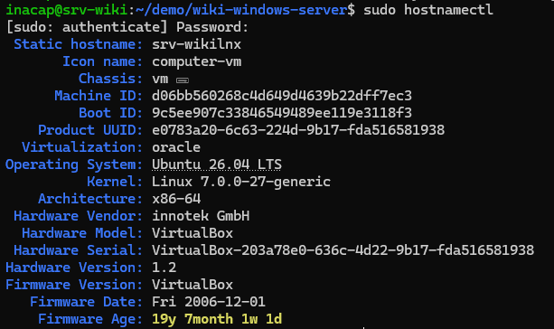

# Conectarse al servidor desde nuestro computador
** Lo siguiente que haremos sera conectarnos a nuestro servidor que esta alojado en la maquina virtual desde nuestro computador, para esto necesitamos ejecutar los siguientes comandos en la terminal de nuestro computador.**

- ssh -p 2222 inacap@localhost.

** Al ejecutar este comando nos pedira la contraseña que configuramos anteriormente, en este caso seria: Inacap2026, que la contraseña para iniciar sesion a nuestro servido en la maquina virtual.**

** El siguiente paso es configurar el hostname de nuestro servidor, para esto ejecutaremos el siguiente comando:**

- sudo hostnamectl set-hostname srv-wiki

** Este comando lo que hace es cambiar el hostname de nuestro servidor a "srv-wiki", para verificar que se haya cambiado correctamente ejecutaremos el siguiente comando:**

- hostnamectl

** Los siguientes comando a ejecutar son los siguientes:**

- sudo apt update

** Este comando lo que hace es actualizar la lista de paquetes disponibles y sus versiones, pero no instala ni actualiza ningún paquete.**

- sudo apt upgrade -y

** Este comando lo que hace es instalar las versiones más recientes de todos los paquetes actualmente instalados en el sistema.**

.png)

** El siguiente comando seria:**

-ip a

** Este comando lo que hace es mostrar la configuración de red de nuestro servidor, incluyendo las direcciones IP asignadas a cada interfaz de red.**

** Los siguientes comandos a ejecutar son:**

- sudo ufw allow OpenSSH

** Permite las conexiones SSH a través del firewall (si ejecutas el comando "sudo ufw enable" antes de este te quedaras sin acceso SSH)**

- sudo ufw allow 80/tcp

** Abre el puerto 80 (HTTP) en el firewall para permitir el tráfico web entrante. Por ejemplo, sin instalas Apache o Nginx, este comando permite que otras persona puedan acceder a tu sitio web desde un navegador.**

- sudo ufw enable

** Habilita el firewall UFW (Uncomplicated Firewall) y aplica las reglas configuradas. Esto es importante para proteger tu servidor de accesos no autorizados.**

- sudo ufw status verbose

** Este comando muestra el estado actual del firewall UFW, incluyendo las reglas activas y el tráfico permitido o bloqueado. Es útil para verificar que las configuraciones de seguridad se hayan aplicado correctamente.**

