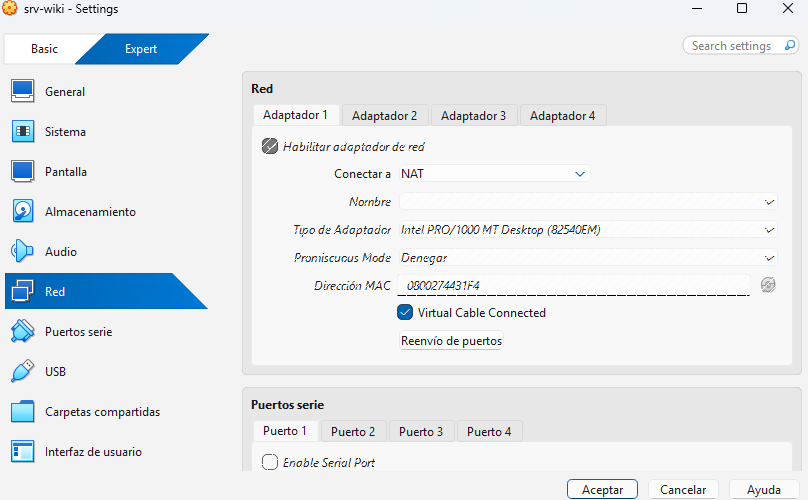
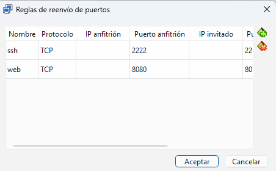

# Inicio

### Obejetivo
** El objetivo de esta wiki es documentar un paso a paso de como instalar y configurar Linux Server y algunas de sus funciones basicas.**

### Topologia
** Lo que vamos a montar en nuestra maquina virtual sera lo siguiente:**
- Tu PC (anfitrion) 
- VM: srv-wiki (Ubuntu Server / red NAT)|
- navegador http://localhost:8080 -> nginx (puerto 80) -> /var/www/wiki|
- terminal ssh -p 2222 ... -> SSH (puerto 22)

