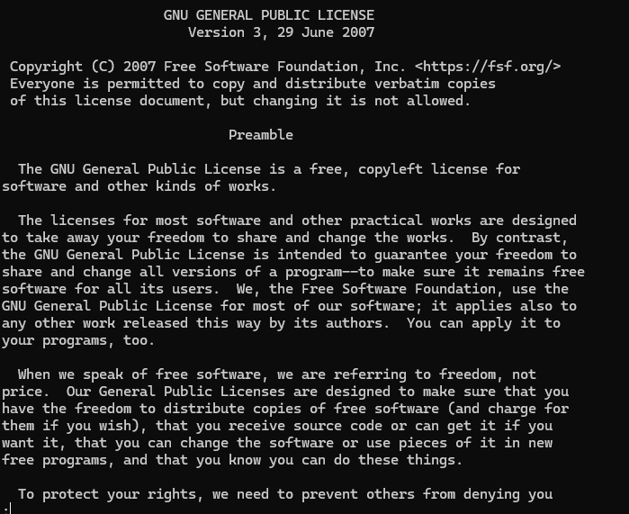
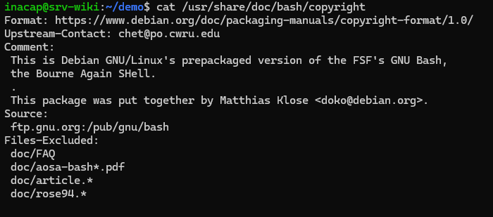

# Software libre y licencias

** A continuacion se mostraran algunos comando para ver las licencias de Linux Server**

- ls /usr/share/common-licenses/
- less /usr/share/common-licenses/GPL-3
- cat /usr/share/doc/bash/copyright

